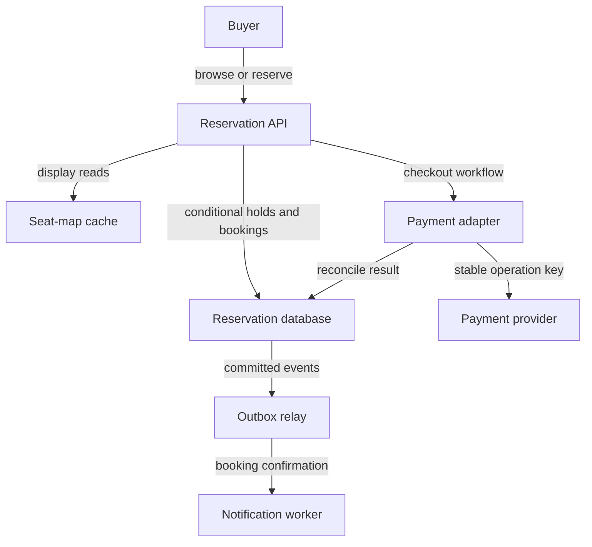

# Design a ticket-booking system

ID: cs-01 | Stage: advanced | Suggested study: 75 minutes

Prerequisites: sd-04, sd-05, sd-06, sd-08, sd-14, sd-16, sd-17, sd-18

[Curriculum map](../curriculum-map.md) · [Catalogue](../catalogue.json)

Build a reservation workflow whose correctness survives double clicks, expired holds, payment delays, and heavy contention.

All scale figures and targets below are hypothetical exercise assumptions. The architecture is an original reference design, not a description of a named company's production system.

## Learning objectives

- Enforce exclusive ownership of a seat despite concurrent requests.
- Model expiring holds and uncertain payment outcomes.
- Protect the authoritative reservation path during a flash crowd.

## Scenario and requirements

Design a fictional venue service with 20,000 assigned seats and an opening burst of 50,000 reservation attempts/minute. These are exercise assumptions. Users browse availability, temporarily hold a seat, pay, and receive a ticket. The invariant is at most one confirmed booking for each (event_id, seat_id). Availability displays may lag by several seconds, but confirmation must check authoritative ownership. A successful payment alone is not a ticket. Target a five-minute hold, and define expiry using the reservation authority's clock.

## Capacity and first design

50,000/minute is about 833 reservation attempts/s, but average per-seat traffic is misleading: many users can contend for the same best seat. Start with a transactional reservation store partitionable by event, an API, a payment adapter, and asynchronous notification. Cache the seat map for browsing. Rate-limit and queue admission before the hot reservation path, preserving a clear distinction between waiting-room admission and an actual seat hold.

## API and data model

POST /events/{event}/holds accepts seat_id and an idempotency key. GET /holds/{id} returns status and expiry. POST /holds/{id}/checkout starts a durable workflow. Store Seat(event_id, seat_id, state, hold_id, hold_expires_at, version), Hold(id, user_id, operation_key, state), Booking(id, event_id, seat_id, hold_id), and PaymentAttempt(id, hold_id, provider_key, state). Enforce a unique confirmed booking per event/seat through the database model, not an application-only check. Keep a durable outbox for booking events.

## Reference flow

In a short transaction, atomically claim an available or authoritatively expired seat, create the hold, and record the request result. Exactly one competing claim may succeed. Payment processing happens outside this transaction. Before final confirmation, atomically verify that the same hold still owns the seat, that its permitted state/expiry rule allows confirmation, and that payment is confirmed. Then create the booking and outbox event together. The expiration worker and checkout compete through conditional transitions on the same authoritative record. PostgreSQL's transaction and isolation rules provide the primitives; the specific state machine here is a proposed design. [Transaction isolation](https://www.postgresql.org/docs/current/transaction-iso.html).

## Failure walkthrough

Buyer A's hold expires while payment is unresolved. Buyer B claims the seat. A's delayed payment success arrives. A must not overwrite B's ownership. Move A's workflow into a refund/void path and show a pending resolution until it completes. If the payment succeeded and the HTTP response was lost, the original operation key must retrieve or reconcile the same payment. If an expiry job runs twice, its conditional transition should have no additional effect. Never rely on a cache expiry as the sole reservation authority.

## Trade-offs and operations

Keeping all state for one event together simplifies seat invariants but can create an event hotspot. Sharding by seat spreads storage load while complicating atomic adjacent-seat purchases. A multi-seat hold should claim all requested seats in one supported transaction or visibly return a partial offer under a different contract. Measure hold success/conflict rate, checkout completion, unresolved payments, expired-hold cleanup lag, and hot-row waits. A cached seat map can remain available during authoritative-store trouble, but new confirmations must honor the invariant.

## Practice

Draw the interleaving between expiration and payment confirmation for one hold. Then redesign for buying four adjacent seats together. Inject a crash after booking commit but before event publication. State what the user sees in each case.

## Answer guidance

Expiry and confirmation must use mutually exclusive conditional transitions at the seat authority. Define whether a checkout can extend a hold before starting payment; an extension itself must be atomic and authorized. For all-or-nothing adjacent seats, acquire/update them in a consistent order within a supported transaction and retry detected conflicts within a budget. The booking plus outbox commit survives the crash; publication resumes with duplicate-safe consumers. The user can read the durable booking even if notification is delayed.

## Reference architecture

Arrows show logical interactions; they do not imply that every edge is synchronous or shares a transaction. The written flow specifies authority and commit boundaries.

## Architecture-builder brief

Required reasoning: the cache is a display path; the database is the reservation authority; the external payment has a recoverable identity. Challenge distractor: confirming a booking directly from a cached available flag. Accept alternate architectures only if they enforce the same ownership and recovery rules.

## Knowledge check

### 1. Can two users both see a seat as available without violating correctness?

Yes. The display may be stale; the authoritative claim and confirmation must still have one winner.

### 2. Why not hold a database transaction open throughout payment?

A slow external call would retain locks/resources, and the transaction still cannot roll back a provider's independent effect.

### 3. What happens to a late successful payment after the seat is reassigned?

Reconcile and void/refund under an explicit workflow; do not issue a second ticket.

## Assessment rubric

Score each criterion from 0 to 4: 0 absent, 1 named, 2 described, 3 supported by a correct failure trace, 4 justified with a trade-off and a verification plan. Maximum 20; suggested mastery is 16 or more with no violated core invariant.

| Criterion | Evidence | Maximum |
|---|---|---|
| Seat invariant | Shows an enforceable uniqueness/conditional-update boundary. | 4 |
| Expiry race | Traces both winner orders without double confirmation. | 4 |
| Payment uncertainty | Uses stable identity, reconciliation, and compensation. | 4 |
| Overload | Protects authoritative work and separates browsing freshness. | 4 |
| Recovery | Uses durable workflow/outbox state and repeat-safe consumers. | 4 |

## Sources and scope

Sources reviewed 2026-09-27. Linked sources support the referenced mechanisms; workloads, architecture choices, exercises, and grading are original teaching material. Recheck provider contracts before implementation.

- [Transaction Isolation](https://www.postgresql.org/docs/current/transaction-iso.html)
- [Making Retries Safe with Idempotent APIs](https://aws.amazon.com/builders-library/making-retries-safe-with-idempotent-APIs/)
- [Outbox Event Router](https://debezium.io/documentation/reference/stable/transformations/outbox-event-router.html)
- [Saga Orchestration Pattern](https://docs.aws.amazon.com/prescriptive-guidance/latest/cloud-design-patterns/saga-orchestration.html)

