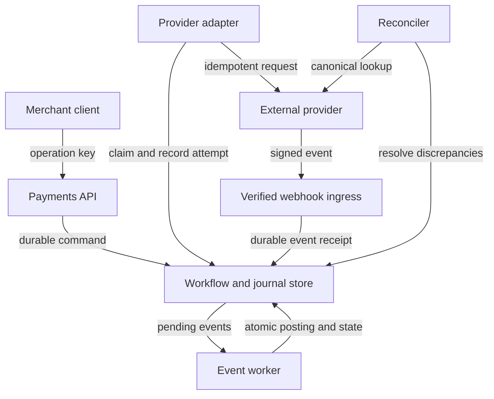

# Design a payment-processing workflow

ID: cs-02 | Stage: production | Suggested study: 90 minutes

Prerequisites: sd-14, sd-15, sd-16, sd-17, sd-19, sd-20, sd-23, sd-24

[Curriculum map](../curriculum-map.md) · [Catalogue](../catalogue.json)

Design the application-side payment workflow around stable operation identity, durable state, and reconciliation.

All scale figures and targets below are hypothetical exercise assumptions. The architecture is an original reference design, not a description of a named company's production system.

## Learning objectives

- Preserve one logical payment across retries and ambiguous responses.
- Maintain an auditable balanced journal.
- Reconcile provider state with local workflow and accounting state.

## Scenario and requirements

Design a fictional merchant payment service handling 100,000 payment attempts/day with a 20× peak factor. It creates charges through an external provider, records outcomes, and supports refunds. This exercise concerns software behavior rather than regulatory or accounting certification. Invariants: each logical operation has one identity; a journal transaction balances within a currency; each accepted provider event is applied according to an idempotent state transition. Unknown outcomes stay visible until resolved.

## Capacity and first design

Average attempts are about 1.16/s, with an assumed peak around 23/s. Correctness dominates this initial scale. Use an API, durable payment workflow database, provider adapter, verified webhook ingress, outbox, and reconciler. Keep the authoritative journal close to workflow state so a local transaction can record related effects. Partitioning can wait until measured data volume or contention justifies it; it does not solve ambiguous remote outcomes.

## API and data model

POST /payments takes amount_minor, currency, merchant-scoped operation_key, and a provider token/reference. GET /payments/{id} reports pending, succeeded, failed, or needs_reconciliation. POST /payments/{id}/refunds creates a separately identified refund. Store Payment, ProviderAttempt, ProviderEvent, JournalTransaction, JournalEntry, and Outbox. Use integer minor units for the declared currency convention. Enforce uniqueness of operation keys and provider-event IDs. Journal entries are append-only in this design; corrections use linked reversing/adjustment entries.

## Reference flow

Durably accept a payment command, then call the provider with the same key across retries. Stripe documents provider-specific idempotency behavior, including retention and parameter checking; applications must follow the actual provider contract rather than assume infinite deduplication. Verify webhook authenticity, persist receipt, acknowledge promptly after durable acceptance, and process asynchronously. Stripe also documents duplicate and unordered webhook delivery. Reconcile uncertain attempts using the provider's canonical state. [Idempotent requests](https://docs.stripe.com/api/idempotent_requests), [Webhooks](https://docs.stripe.com/webhooks).

## Journal example

For an illustrative 2,500-minor-unit transfer between two internal journal accounts, write entries +2,500 and -2,500 in the same journal transaction, with the same currency and operation reference. The sum is zero. The meaning of those accounts belongs to the business's accounting model; do not infer that a provider success equals cash settlement. Apply a uniqueness rule to the corresponding logical posting so duplicate events cannot post it again. Update workflow state and publication intent atomically where they share the store.

## Failure walkthrough

The provider accepts a charge, but the response is lost. The client retries. Preserve the original operation ID and query or retry under the provider's documented contract. A webhook may arrive before the API response or after a later status event; reconcile canonical state rather than forcing transitions solely from arrival order. If the provider's idempotency window has elapsed, do not blindly submit a new charge. Put unresolved cases into reconciliation/manual review. If a refund times out, it has its own uncertain operation rather than reverting the original charge locally.

## Trade-offs and operations

A single transactional journal reduces coordination complexity but needs appropriate partitioning and retention as it grows. Reconciliation is a primary path, not just an emergency script. Compare local attempts, provider transactions, settlement records where available, and journal postings using durable references. Measure unresolved count/age, duplicate suppression, webhook verification failures, unbalanced posting rejections, and reconciliation discrepancies. Limit sensitive data to what the integration actually requires and protect operator actions with explicit authorization and audit history.

## Practice

Trace an API timeout, two duplicate webhooks, and a late refund response. Show how many journal transactions are created for the charge and refund, where each unique constraint applies, and which unknown states remain after each event.

## Answer guidance

The charge and refund are distinct logical operations, each with repeat-safe provider and local identities. Repeated receipt of one event can create multiple delivery logs but must not repeat its business posting. Post according to the defined canonical transition and accounting model; never invent a final result to clear a timeout. A balanced journal prevents one class of corruption, while reconciliation is still needed to detect missing, wrong, or misclassified balanced entries.

## Reference architecture

Arrows show logical interactions; they do not imply that every edge is synchronous or shares a transaction. The written flow specifies authority and commit boundaries.

## Architecture-builder brief

Required reasoning: webhook receipt is distinct from business processing; the provider effect lies outside the local transaction. Challenge distractor: mark every timed-out payment failed and issue a new operation key. Grade journal invariants and uncertainty handling, not provider brand choice.

## Knowledge check

### 1. Does a balanced journal prove the provider and application agree?

No. Entries can balance while being missing, duplicated under different identities, or assigned to the wrong business meaning.

### 2. Can webhook arrival order be used as the authoritative payment sequence?

No. Delivery can be repeated or reordered; validate transitions and reconcile canonical state.

### 3. Why does a refund need its own operation identity?

It is a separate external effect that can also be retried or have an uncertain outcome.

## Assessment rubric

Score each criterion from 0 to 4: 0 absent, 1 named, 2 described, 3 supported by a correct failure trace, 4 justified with a trade-off and a verification plan. Maximum 20; suggested mastery is 16 or more with no violated core invariant.

| Criterion | Evidence | Maximum |
|---|---|---|
| Identity | Scopes and retains logical operation identities correctly. | 4 |
| Atomic journal | Checks balance and uniqueness within a durable transaction. | 4 |
| External boundary | Explains uncertain charge/refund results and provider limits. | 4 |
| Webhooks | Verifies, durably accepts, and processes duplicate/reordered events. | 4 |
| Reconciliation | Defines measurable discrepancy and repair workflows. | 4 |

## Sources and scope

Sources reviewed 2026-09-27. Linked sources support the referenced mechanisms; workloads, architecture choices, exercises, and grading are original teaching material. Recheck provider contracts before implementation.

- [Idempotent Requests](https://docs.stripe.com/api/idempotent_requests)
- [Webhooks](https://docs.stripe.com/webhooks)
- [Making Retries Safe with Idempotent APIs](https://aws.amazon.com/builders-library/making-retries-safe-with-idempotent-APIs/)
- [Outbox Event Router](https://debezium.io/documentation/reference/stable/transformations/outbox-event-router.html)

