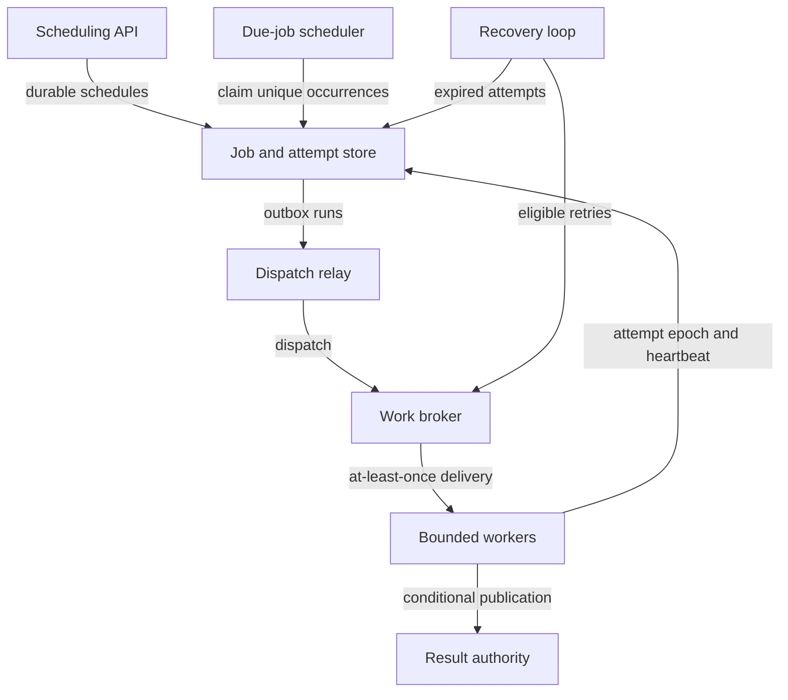

# Design a durable job scheduler

ID: cs-03 | Level: Advanced | Stage: Reason about guarantees | Suggested study: 90 minutes

Prerequisites: sd-09, sd-10, sd-14, sd-16, sd-18, sd-20, sd-26, sd-28

[Curriculum map](../curriculum-map.md) · [Catalogue](../catalogue.json)

Build a scheduler that can explain every accepted job through retries, stale workers, and leadership changes.

All scale figures and targets below are hypothetical exercise assumptions. The architecture is an original reference design, not a description of a named company's production system.

## Learning objectives

- Separate scheduling, dispatch, execution, and effect guarantees.
- Recover jobs after worker and scheduler failures.
- Use fencing and tenant budgets without promising universal exactly-once execution.

## Scenario and requirements

Design a fictional platform with one million scheduled runs/day and a 10× peak factor. Jobs include report generation and tenant data exports. A job may run more than once, but its declared result publication must be repeat-safe. Users need scheduled time, current status, attempt history, cancellation state, and a result or visible terminal failure. Define recurrence timezone and daylight-saving behavior explicitly.

## Capacity and first design

One million/day is about 11.57 runs/s; the assumed peak is about 116/s. If mean execution time is two seconds, peak active execution is roughly 232 under a steady approximation, before safety margin and workload variation. Long exports need separate budgets from short reports. Begin with a durable job store, due-job scheduler, broker/dispatch relay, bounded worker groups, result store, and a reconciliation loop.

## API and data model

POST /jobs accepts operation_key, handler_version, scheduled_at, payload reference, and retry policy. POST /jobs/{id}/cancel requests cancellation; GET /jobs/{id} exposes state. Store Schedule, Run(unique schedule_id + scheduled occurrence), Attempt(run_id, attempt_no, owner_epoch, lease_expiry), Result, and Outbox. A scheduled occurrence has one identity even when more than one scheduler notices it. Store the interpretation of recurring times so a timezone rule change does not silently rewrite historical identities.

## Reference flow

The scheduler claims due occurrences and durably creates runs/publication intent. Workers acquire an attempt with an incremented owner epoch, perform bounded work, and publish a result through a conditional transition. PostgreSQL SKIP LOCKED can support concurrent claiming from a queue-like table, but it skips locked rows and is not a general consistency mechanism. Google's scheduling discussion emphasizes reliable persisted scheduling state and idempotent external operations during recovery. [SELECT locking clauses](https://www.postgresql.org/docs/current/sql-select.html), [Distributed scheduling](https://sre.google/sre-book/distributed-periodic-scheduling/).

## Lease and failure walkthrough

Worker A receives epoch 8, then stops responding. Its lease expires and worker B gets epoch 9. Both may now physically execute. The result authority installs/checks the current epoch atomically; A cannot publish over B's result. A heartbeat reduces unnecessary replacement but cannot prove that old work stopped. If a handler sends an email to a provider that does not enforce the epoch, fencing the local result does not deduplicate the email. That handler needs provider idempotency or a different contract.

## Cancellation and fairness

Cancellation is a durable request, not proof of interruption. A queued run may transition directly to canceled; a running job may observe cancellation before the next safe point; an already-completed external effect may need compensation. Bound per-tenant active jobs and queued work, with a global ceiling. Use weighted service or separate worker classes for long jobs, and define maximum postponement to prevent starvation. Retries consume the same budgets instead of bypassing them.

## Trade-offs and operations

A database-backed dispatcher is simple at moderate scale; a large timing wheel or partitioned scheduler can reduce polling pressure later. A single scheduler leader simplifies due-time ownership while requiring recoverable leadership; multiple schedulers require atomic deduplication/claiming. Keep handler versions or payload schemas compatible with delayed jobs. Monitor scheduling delay, oldest eligible run, attempt count, lease churn, worker saturation, terminal failures, and stale-epoch rejections.

## Practice

Build a timeline where the scheduler crashes after storing a run but before dispatch, then a worker crashes after writing an object but before marking completion. Show recovery and cleanup. Add a tenant that submits 100 times more work than everyone else.

## Answer guidance

Dispatch resumes from durable outbox/run state without creating a new occurrence. The retry uses the same run identity and a new attempt epoch; object keys/result publication must make repeated work harmless or detect existing output. Orphan objects require a retention-aware cleanup policy. Tenant budgets prevent the noisy tenant from taking every worker; prioritize by a documented policy and measure starvation. Do not call the result 'exactly-once execution' when physical attempts can overlap.

## Reference architecture

Arrows show logical interactions; they do not imply that every edge is synchronous or shares a transaction. The written flow specifies authority and commit boundaries.

## Architecture-builder brief

Required reasoning: distinguish broker delivery from authoritative ownership and result publication. Challenge distractor: trust a worker's local clock and publish after any lease it once held. Accept queue-less implementations if they show equally durable claiming, bounded polling, and recovery.

## Knowledge check

### 1. Can lease expiry guarantee that only one worker is running?

No. An old worker may be paused or partitioned and later resume.

### 2. What should identify one recurring occurrence?

A stable schedule identity plus a precisely defined occurrence, independent of which scheduler discovers it.

### 3. Does fencing a result row deduplicate every external effect?

No. Every affected destination needs a compatible idempotency or authority protocol.

## Assessment rubric

Score each criterion from 0 to 4: 0 absent, 1 named, 2 described, 3 supported by a correct failure trace, 4 justified with a trade-off and a verification plan. Maximum 20; suggested mastery is 16 or more with no violated core invariant.

| Criterion | Evidence | Maximum |
|---|---|---|
| Run identity | Deduplicates scheduling and dispatch independently. | 4 |
| Ownership | Uses atomic epoch checks and traces stale-worker behavior. | 4 |
| Effects | States the limits of execution and effect guarantees. | 4 |
| Fairness | Bounds tenant work, retries, and starvation. | 4 |
| Recovery | Explains crash, cancellation, orphan, and version recovery. | 4 |

## Sources and scope

Sources reviewed 2026-09-27. Linked sources support the referenced mechanisms; workloads, architecture choices, exercises, and grading are original teaching material. Recheck provider contracts before implementation.

- [Distributed Periodic Scheduling with Cron](https://sre.google/sre-book/distributed-periodic-scheduling/)
- [SELECT: Locking Clauses](https://www.postgresql.org/docs/current/sql-select.html)
- [How to Do Distributed Locking](https://martin.kleppmann.com/2016/02/08/how-to-do-distributed-locking.html)
- [Consumer Acknowledgements and Publisher Confirms](https://www.rabbitmq.com/docs/confirms)

