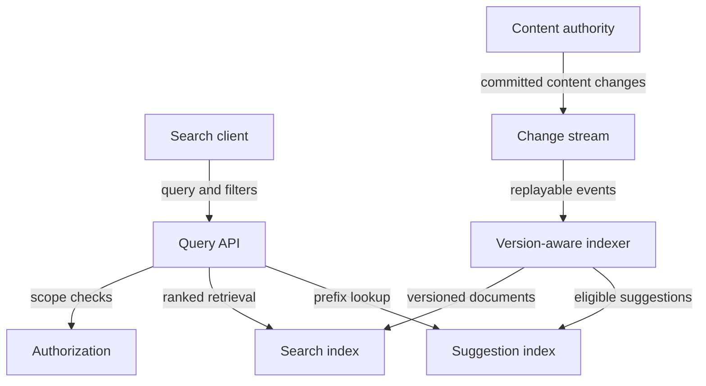

# Design search and autocomplete

ID: cs-04 | Stage: advanced | Suggested study: 75 minutes

Prerequisites: sd-05, sd-08, sd-12, sd-15, sd-16, sd-18

[Curriculum map](../curriculum-map.md) · [Catalogue](../catalogue.json)

Design a search service that stays useful while its derived index lags, rebuilds, and handles repeated events.

All scale figures and targets below are hypothetical exercise assumptions. The architecture is an original reference design, not a description of a named company's production system.

## Learning objectives

- Build a recoverable projection from authoritative content.
- Define search freshness and deletion visibility.
- Separate full-text relevance from prefix suggestions and authorization.

## Scenario and requirements

Design search over one million fictional learning resources. Peak traffic is 300 search requests/s and 1,500 autocomplete requests/s. Updates average 20/s. Users search text, filter by topic/difficulty, and see suggestions while typing. Assume a proposed p95 search target of 250 ms and a 60-second target for normal content freshness; these are exercise goals to validate, not benchmark claims. Private resources and revoked permissions must not be exposed just because an index is stale.

## Capacity and first design

At an illustrative 4 KB indexed payload per resource, raw document content is about 4 GB before index structures, replicas, stored fields, and operational headroom. Actual index size requires measurement. Separate the content authority from a derived search projection. An outbox/change stream feeds indexers; the query API reads the search service and applies the required visibility/authorization rules. Autocomplete may use a dedicated suggestion structure because per-keystroke traffic and prefix access differ from full-text retrieval.

## API and data model

GET /search accepts q, filters, sort, and a cursor bound to those parameters. GET /suggest accepts a bounded prefix and context. Store document_id, tenant/scope, title, searchable text, tags, visibility, and source_version in the projection. Track indexed_source_version and ingestion lag operationally. Suggestions have their own publication and visibility policy; do not include private titles in a public prefix index.

## Reference flow

A content edit commits authoritative state plus an event. The indexer applies the document only if its source version is newer than the stored projection version. Deletes carry durable versioned tombstones or an equivalent replay-safe policy. Elastic documents that search visibility follows refresh, which is distinct from the source database commit. Its completion suggester is a specialized navigation-oriented mechanism rather than a replacement for general text search. [Near-real-time search](https://www.elastic.co/docs/manage-data/data-store/near-real-time-search), [Suggesters](https://www.elastic.co/docs/reference/elasticsearch/rest-apis/search-suggesters).

## Ranking and pagination

Start with a stated relevance policy: text match with explicit boosts for title and exact topic match, then evaluate on a curated query set. A ranking improvement must not bypass filters. Use a stable sort with a unique tiebreaker for pagination; relevance scores can change as the index changes. If the product promises stable traversal, use an appropriate point-in-time search view and expiry policy. Debounce/cancel obsolete suggestion requests on the client, but also bound server work because canceled requests may already be executing.

## Failure walkthrough

Update v12 reaches the index before delayed v11. An atomic version rule prevents v11 from replacing it. During a full rebuild, build a new index from a consistent source position plus subsequent changes, verify coverage, then switch the read alias/pointer. A snapshot without a catch-up boundary can miss edits made during the rebuild. If permission is revoked while the index lags, enforce the chosen authorization boundary at query/result delivery; eventual text freshness cannot justify a privacy leak.

## Trade-offs and operations

More aggressive refresh improves freshness at indexing cost. Prefix indexes can increase memory usage and need abuse limits for short/high-fan-out prefixes. Query caches must include relevant tenant and filter scope. Track ingestion lag, oldest unapplied change, version conflicts, refresh/search latency, empty-result rate, and relevance evaluation outcomes. Distinguish a healthy empty result from an unavailable search backend. Under load, reduce optional facets or suggestions before harming core authorized retrieval.

## Practice

Design a rebuild while 20 updates/s continue. Explain your source snapshot/change boundary, duplicate handling, verification, cutover, and rollback. Include a deleted private resource that appears in the old snapshot.

## Answer guidance

Capture a consistent snapshot with a change-stream position or another proven no-gap mechanism. Index the snapshot, apply subsequent versioned changes including deletions, and verify counts plus sampled content/permission cases. Switch reads only after the freshness/coverage checks pass; preserve a rollback path with its own freshness considerations. A stale snapshot row must not resurrect a newer tombstone. Keep authoritative authorization effective throughout.

## Reference architecture

Arrows show logical interactions; they do not imply that every edge is synchronous or shares a transaction. The written flow specifies authority and commit boundaries.

## Architecture-builder brief

Required reasoning: search is a rebuildable projection with an explicit freshness contract. Challenge distractor: trust stale indexed visibility for every private result. Alternative indexes are acceptable when they demonstrate filtering, deletion, replay, and query limits.

## Knowledge check

### 1. Does source-database commit mean a document is immediately searchable?

No. Ingestion and search refresh introduce separate visibility stages.

### 2. Why keep version information on deletes?

A delayed update or snapshot replay must not resurrect a document deleted by a newer version.

### 3. Can autocomplete share the exact access policy of public search by assumption?

No. Suggestions can reveal private titles or sensitive queries and need their own explicit visibility controls.

## Assessment rubric

Score each criterion from 0 to 4: 0 absent, 1 named, 2 described, 3 supported by a correct failure trace, 4 justified with a trade-off and a verification plan. Maximum 20; suggested mastery is 16 or more with no violated core invariant.

| Criterion | Evidence | Maximum |
|---|---|---|
| Projection recovery | Defines no-gap snapshot and change replay. | 4 |
| Version semantics | Handles stale updates, duplicates, and tombstones. | 4 |
| Search quality | Separates relevance, filters, prefix behavior, and pagination. | 4 |
| Authorization | Maintains privacy during lag and rebuild. | 4 |
| Operations | Measures freshness and bounds query/indexing load. | 4 |

## Sources and scope

Sources reviewed 2026-09-27. Linked sources support the referenced mechanisms; workloads, architecture choices, exercises, and grading are original teaching material. Recheck provider contracts before implementation.

- [Near Real-Time Search](https://www.elastic.co/docs/manage-data/data-store/near-real-time-search)
- [Suggesters: Completion Suggester](https://www.elastic.co/docs/reference/elasticsearch/rest-apis/search-suggesters)
- [Paginate Search Results](https://www.elastic.co/docs/reference/elasticsearch/rest-apis/paginate-search-results)
- [Outbox Event Router](https://debezium.io/documentation/reference/stable/transformations/outbox-event-router.html)

