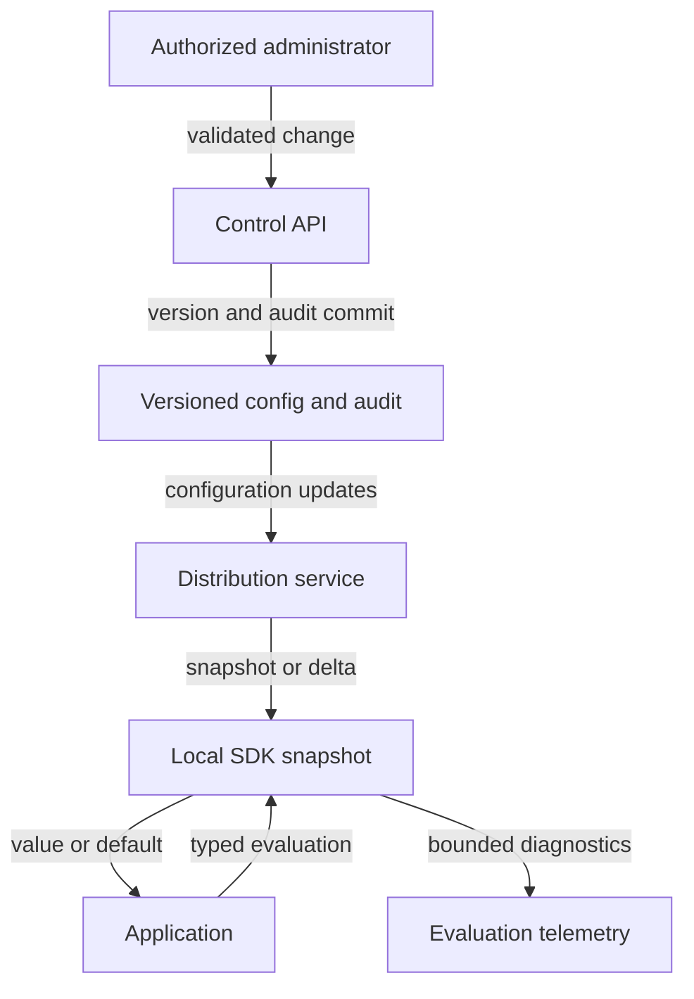

# Design a feature-flag service

ID: cs-05 | Stage: production | Suggested study: 75 minutes

Prerequisites: sd-08, sd-14, sd-16, sd-19, sd-20, sd-22, sd-23

[Curriculum map](../curriculum-map.md) · [Catalogue](../catalogue.json)

Build a flag system whose rollout decisions remain predictable when configuration distribution fails.

All scale figures and targets below are hypothetical exercise assumptions. The architecture is an original reference design, not a description of a named company's production system.

## Learning objectives

- Separate flag administration from request-time evaluation.
- Keep cohorts deterministic across clients and restarts.
- Define safe behavior during stale or unavailable configuration.

## Scenario and requirements

Design flags for 100 fictional services making 50,000 evaluations/s in total, with at most 50 configuration changes/minute. Users need on/off switches, percentage rollout, tenant targeting, audit history, and rollback. The proposed normal propagation target is under ten seconds, with an explicit stale-config policy. An emergency switch has a stated bound only where the delivery/evaluation design can enforce it. Flag values must never substitute for authorization.

## Capacity and first design

Request-time evaluations outnumber writes by orders of magnitude. Evaluate from local validated configuration where appropriate; distribute versioned snapshots/deltas from a control plane. At 100 service processes, a 100 KB snapshot every 30 seconds would transfer about 0.33 MB/s before overhead; more replicas multiply this figure. Prefer incremental updates and periodic reconciliation, while retaining a full-snapshot recovery path. The estimates describe this exercise, not a provider's performance.

## API and data model

The administrative API writes a flag with key, typed value, version, rules, rollout_salt, default_value, owner, and expiry/review date. Each change has an actor and audit record. A distribution endpoint serves a versioned snapshot or updates since a version. SDK evaluation accepts a flag key, typed default, and permitted context. OpenFeature specifies typed evaluation and fallback behavior on abnormal evaluation; it does not prescribe this service's storage or propagation protocol. [Flag Evaluation API](https://openfeature.dev/specification/sections/flag-evaluation/).

## Reference flow

Authorize and validate a change, atomically persist a new configuration version and audit/outbox event, then publish it. SDKs validate and install complete versions atomically. Detect missing or out-of-order deltas and fetch a full snapshot. For a proposed percentage rollout, compute a stable hash over a specified encoding of flag key, fixed rollout salt, and stable subject ID, map to buckets, and compare with a threshold. Keep the algorithm identical across languages and keep salt stable when expanding a cohort.

## Failure walkthrough

The distribution connection fails while a service has version 17. It may continue using the last valid snapshot only under the flag's declared staleness policy. If the process has no valid configuration, return its typed safe default and emit a bounded diagnostic. A kill switch cannot promise immediate disablement on a partitioned process solely through push updates. A stricter control needs expiry/online authority and must accept the corresponding availability trade-off. A flag enabling a user interface still does not authorize the backend action.

## Trade-offs and operations

Remote evaluation centralizes rules but adds latency, availability dependence, and context transfer. Local evaluation is fast and resilient but distributes rules and can expose them to clients; never ship secrets as client-side flag rules. Sticky bucketing improves experimental continuity, while changing identity or salt reshuffles users. Remove obsolete flags after rollout to limit combinatorial test paths. Monitor config-version lag, fallback rate, evaluation errors, update validation failures, and rollout outcomes.

## Practice

A rollout grows from 10% to 20%. Specify how the original cohort remains included, how two languages agree, and what a new service instance does while the configuration endpoint is unavailable. Then define a critical disable flag's maximum staleness behavior.

## Answer guidance

Keep the bucketing function, subject identity, encoding, and salt fixed, increasing only the threshold so the old buckets remain a subset. Publish cross-language test vectors. A new instance uses a valid persisted bootstrap snapshot under policy or a safe typed default; it must not invent the current configuration. A strict disable deadline requires a mechanism such as expiring authorization/config validity with defined failure behavior, not an unbounded cached value.

## Reference architecture

Arrows show logical interactions; they do not imply that every edge is synchronous or shares a transaction. The written flow specifies authority and commit boundaries.

## Architecture-builder brief

Required reasoning: distinguish the control plane from evaluation and demonstrate safe defaults. Challenge distractor: fetch remote configuration synchronously for every local-mode evaluation without a deadline/fallback. Grade deterministic cohorts and stale-config behavior rather than a specific vendor.

## Knowledge check

### 1. Will increasing a threshold preserve the old cohort if the rollout salt also changes?

Not generally. Changing the hash input reshuffles buckets.

### 2. Can a local flag cache guarantee immediate response to a kill switch during a partition?

No. A bounded guarantee needs an expiry or online protocol and a stated failure policy.

### 3. Does enabling a feature flag grant permission to its API?

No. Authorization must independently enforce access.

## Assessment rubric

Score each criterion from 0 to 4: 0 absent, 1 named, 2 described, 3 supported by a correct failure trace, 4 justified with a trade-off and a verification plan. Maximum 20; suggested mastery is 16 or more with no violated core invariant.

| Criterion | Evidence | Maximum |
|---|---|---|
| Evaluation contract | Defines types, defaults, and authorization separation. | 4 |
| Distribution | Handles atomic versions, gaps, and reconnect recovery. | 4 |
| Cohorts | Specifies stable identity, hashing, salt, and test vectors. | 4 |
| Failure policy | States stale-config and emergency-disable limits. | 4 |
| Lifecycle | Provides audit, rollback, telemetry, and flag retirement. | 4 |

## Sources and scope

Sources reviewed 2026-09-27. Linked sources support the referenced mechanisms; workloads, architecture choices, exercises, and grading are original teaching material. Recheck provider contracts before implementation.

- [Flag Evaluation API](https://openfeature.dev/specification/sections/flag-evaluation/)
- [Canarying Releases](https://sre.google/workbook/canarying-releases/)
- [API1:2023 Broken Object Level Authorization](https://api-security.owasp.org/editions/2023/en/0xa1-broken-object-level-authorization/)

