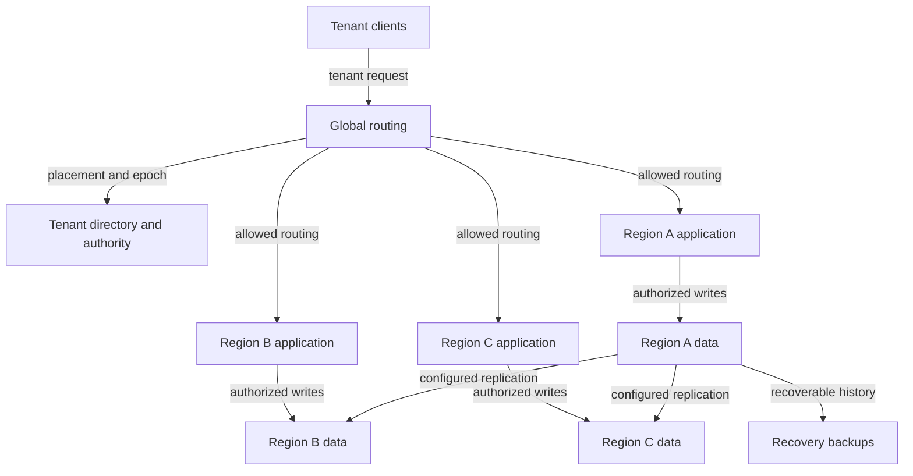

# Design a multi-region SaaS platform

ID: cs-06 | Stage: expert | Suggested study: 100 minutes

Prerequisites: sd-19, sd-20, sd-21, sd-23, sd-24, sd-25, sd-26, sd-28, sd-29

[Curriculum map](../curriculum-map.md) · [Catalogue](../catalogue.json)

Design regional operation and failover around a precise authority model, measurable recovery targets, and tenant isolation.

All scale figures and targets below are hypothetical exercise assumptions. The architecture is an original reference design, not a description of a named company's production system.

## Learning objectives

- Place write authority and data by tenant and invariant.
- Recover regional service without creating competing writers.
- Make latency, recovery, isolation, and cost trade-offs explicit.

## Scenario and requirements

Design a fictional learning SaaS with 5,000 tenants across three regions and 10,000 peak API requests/s. Tenants have home regions, private content, progress data, and exports. Assume the product accepts up to one minute of lost recent progress after a declared disaster, but requires acknowledged billing records to be preserved under its defined failure model. Propose a 15-minute regional recovery target for core reads. These are requirements to prove through design and drills, not guarantees supplied by geography alone.

## Capacity and first design

Start with regional application fleets and tenant-home write ownership. If a 4,000-request/s region fails and traffic divides equally across the other two, each needs 2,000/s extra capacity for that routed workload, plus dependencies and warming. Do not assume every tenant's data may move to every region: placement restrictions are an input to routing. Separate global directory/configuration needs from region-local request execution.

## API and data model

A tenant directory maps tenant_id to home_region, placement policy, authority_epoch, and migration/failover state. All object keys, cache keys, database accesses, and jobs carry validated tenant scope. Writes include an operation identity and route to the current authority. Store replication positions and recovery checkpoints. Define consistency separately for progress, content metadata, billing records, and disposable analytics; one global consistency label is insufficient.

## Reference architecture choices

For progress, asynchronous replication can fit an explicitly accepted loss window if lag is measured and tested. For billing invariants, use an authority/replication protocol that preserves the required acknowledged history across the stated failures, accepting coordination latency or write unavailability. DynamoDB's documented eventual and strong multi-region modes illustrate why product configuration matters, without prescribing DynamoDB for this design. [Global table modes](https://docs.aws.amazon.com/amazondynamodb/latest/developerguide/bp-global-table-design.html). Regional routing and replication are separate mechanisms.

## Failover protocol

Detect and assess the outage, decide which authority may serve each tenant, verify the target's recoverable data position, then install a new authority epoch through a surviving coordination path. Fence the old writer at every protected write authority before enabling conflicting writes. Redirect traffic and validate representative tenant journeys. If the old authority cannot be excluded and no protocol can prove exclusive ownership, keep affected invariant-sensitive writes unavailable. A routing change alone cannot stop an isolated old server from committing.

## Recovery walkthrough

Region A loses connectivity but continues running. Some clients still reach it through existing connections. Region B is promoted without fencing A. Both accept writes, and later replication produces conflicts: this is the bad history the design must prevent. In the corrected flow, B receives authority only through a protocol whose protected stores reject A's old epoch or otherwise make conflicting commitment impossible. When A returns, reconcile its state as a follower and avoid letting it replay stale jobs into current state. Planned failback is a new migration with validation, not simply reversing DNS.

## Trade-offs, isolation, and cost

Home-region writes simplify conflict control but add latency for distant users. Active-active local writes improve locality only for data whose merge rules meet business invariants. Tenant-level partitioning can limit blast radius; shared global dependencies can still defeat regional independence. Account for replication traffic, spare regional capacity, data egress, backup copies, and operational complexity using dated prices later. Monitor per-tenant/region objectives, replication lag, authority conflicts, routing errors, and recovery readiness.

## Practice

A partitioned region contains the tenant directory leader and 40% of traffic. Explain which tenant reads and writes continue, how a new authority can or cannot be established, what data could be lost, and how you validate the 15-minute read-recovery target. Include a tenant whose placement policy excludes one surviving region.

## Answer guidance

The directory/coordination protocol must have a surviving quorum or an explicitly designed recovery procedure; never fabricate one during the outage. Regional reads may continue under a documented stale-data contract, while writes depend on reachable exclusive authority and data placement. Estimate loss from actual durable replication positions, not only a latency dashboard average. Route the restricted tenant only to permitted locations, or report unavailable. Measure detection, decision, restoration, validation, and routing during a drill; fail the target honestly if any required phase exceeds it.

## Reference architecture

Arrows show logical interactions; they do not imply that every edge is synchronous or shares a transaction. The written flow specifies authority and commit boundaries.

## Architecture-builder brief

The diagram shows one illustrative home-region replication arrangement, not permission for all three replicas to write the same tenant simultaneously. Required reasoning: authority, replication, and routing each have explicit protocols. Challenge distractor: promote an async replica and update DNS without fencing the previous writer.

## Knowledge check

### 1. Does changing DNS establish a single writer?

No. Existing connections and partitioned old servers can continue; authority must be enforced at the write boundary.

### 2. Can the same RPO be assumed for every data class?

No. Replication, acknowledgement, retention, and recovery rules can differ by invariant and data class.

### 3. Is a globally reachable directory enough to make a service region-independent?

No. Its own quorum, data plane dependencies, identity services, keys, and recovery paths must survive the required failures.

## Assessment rubric

Score each criterion from 0 to 4: 0 absent, 1 named, 2 described, 3 supported by a correct failure trace, 4 justified with a trade-off and a verification plan. Maximum 20; suggested mastery is 16 or more with no violated core invariant.

| Criterion | Evidence | Maximum |
|---|---|---|
| Authority | Prevents conflicting writes during partition and failover. | 4 |
| Data contracts | Separates consistency and RPO by invariant and failure model. | 4 |
| Tenant isolation | Enforces scope and placement during routing/recovery. | 4 |
| Capacity and cost | Budgets failed-region load and replication overhead. | 4 |
| Recovery evidence | Defines measurable drills, failback, and honest unavailable states. | 4 |

## Sources and scope

Sources reviewed 2026-09-27. Linked sources support the referenced mechanisms; workloads, architecture choices, exercises, and grading are original teaching material. Recheck provider contracts before implementation.

- [Using DynamoDB Global Tables](https://docs.aws.amazon.com/amazondynamodb/latest/developerguide/bp-global-table-design.html)
- [How to Do Distributed Locking](https://martin.kleppmann.com/2016/02/08/how-to-do-distributed-locking.html)
- [In Search of an Understandable Consensus Algorithm (extended version)](https://raft.github.io/raft.pdf)
- [Continuous Archiving and Point-in-Time Recovery](https://www.postgresql.org/docs/current/continuous-archiving.html)
- [Row Security Policies](https://www.postgresql.org/docs/current/ddl-rowsecurity.html)

